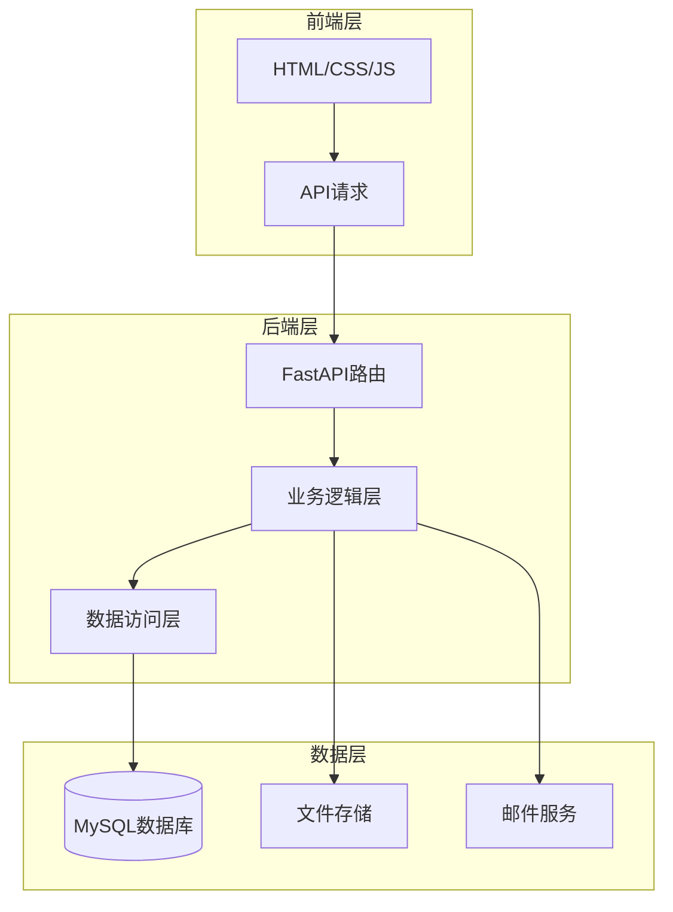

# 设计文档

## 概述

班级文件收集系统是一个基于Python的Web应用，采用FastAPI作为后端框架，MySQL 8.0作为数据库，前端使用简洁的HTML/CSS/JavaScript。系统支持学院-年级-班级的层级组织结构，提供文件收集、批量导出、自动重命名、QQ邮箱提醒等核心功能。

## 架构

系统采用经典的三层架构：



### 技术栈

- **后端框架**: FastAPI (Python 3.9+)
- **数据库**: MySQL 8.0
- **ORM**: SQLAlchemy + PyMySQL/aiomysql
- **文件处理**: python-multipart, openpyxl, zipfile
- **邮件服务**: smtplib (QQ邮箱SMTP)
- **定时任务**: APScheduler
- **前端**: HTML5, CSS3, Vanilla JavaScript
- **部署**: Docker, Uvicorn

## 组件和接口

### 1. API路由模块

```
/api/v1/
├── auth/                    # 认证相关
│   ├── POST /login          # 管理员登录
│   └── POST /setup          # 初始设置
├── colleges/                # 学院管理
│   ├── GET /                # 获取学院列表
│   ├── POST /               # 创建学院
│   ├── PUT /{id}            # 更新学院
│   └── DELETE /{id}         # 删除学院
├── grades/                  # 年级管理
│   ├── GET /                # 获取年级列表
│   ├── POST /               # 创建年级
│   ├── PUT /{id}            # 更新年级
│   └── DELETE /{id}         # 删除年级
├── classes/                 # 班级管理
│   ├── GET /                # 获取班级列表
│   ├── POST /               # 创建班级
│   ├── PUT /{id}            # 更新班级
│   └── DELETE /{id}         # 删除班级
├── members/                 # 成员管理
│   ├── GET /                # 获取成员列表
│   ├── POST /               # 创建成员
│   ├── PUT /{id}            # 更新成员
│   ├── DELETE /{id}         # 删除成员
│   ├── GET /template        # 下载导入模板
│   ├── POST /import         # 批量导入成员
│   └── GET /export          # 导出成员列表
├── tasks/                   # 收集任务管理
│   ├── GET /                # 获取任务列表
│   ├── POST /               # 创建任务
│   ├── PUT /{id}            # 更新任务
│   ├── DELETE /{id}         # 删除任务
│   ├── GET /{id}/stats      # 获取任务统计
│   ├── POST /{id}/remind    # 手动发送提醒
│   └── POST /{id}/remind/selected  # 向选中成员发送提醒
├── submissions/             # 文件提交
│   ├── GET /                # 获取提交列表
│   ├── POST /               # 上传文件
│   ├── PUT /{id}            # 替换文件
│   ├── DELETE /{id}         # 删除提交
│   └── GET /export          # 批量导出
└── settings/                # 系统设置
    ├── GET /naming-format   # 获取命名格式
    ├── PUT /naming-format   # 设置命名格式
    ├── GET /email           # 获取邮箱配置
    └── PUT /email           # 设置邮箱配置（SMTP服务器等）
```

### 2. 业务逻辑模块

- **OrganizationService**: 处理学院、年级、班级的CRUD操作和级联删除
- **MemberService**: 处理成员管理、导入导出、模板生成
- **TaskService**: 处理收集任务的创建、配置、状态管理
- **SubmissionService**: 处理文件上传、验证、存储
- **ExportService**: 处理批量导出、文件重命名、ZIP打包
- **AuthService**: 处理管理员认证、会话管理
- **EmailService**: 处理QQ邮箱提醒发送、SMTP配置
- **SchedulerService**: 处理自动提醒定时任务

### 3. 数据访问模块

- **BaseRepository**: 通用CRUD操作
- **CollegeRepository**: 学院数据访问
- **GradeRepository**: 年级数据访问
- **ClassRepository**: 班级数据访问
- **MemberRepository**: 成员数据访问
- **TaskRepository**: 任务数据访问
- **SubmissionRepository**: 提交数据访问

## 数据模型

```mermaid
erDiagram
    College ||--o{ Grade : contains
    Grade ||--o{ Class : contains
    Class ||--o{ Member : contains
    Class ||--o{ Task : has
    Task ||--o{ Submission : receives
    Member ||--o{ Submission : submits
    
    College {
        int id PK
        string name
        datetime created_at
        datetime updated_at
    }
    
    Grade {
        int id PK
        string name
        int college_id FK
        datetime created_at
        datetime updated_at
    }
    
    Class {
        int id PK
        string name
        int grade_id FK
        datetime created_at
        datetime updated_at
    }
    
    Member {
        int id PK
        string student_id UK
        string name
        string gender
        string dormitory
        string qq_email
        int class_id FK
        datetime created_at
        datetime updated_at
    }
    
    Task {
        int id PK
        string title
        string description
        int class_id FK
        json allowed_types
        datetime deadline
        int max_uploads
        boolean allow_modify
        boolean admin_only_visible
        string naming_format
        int remind_before_hours
        boolean auto_remind_enabled
        datetime created_at
        datetime updated_at
    }
    
    Submission {
        int id PK
        int task_id FK
        int member_id FK
        string original_filename
        string stored_filename
        string file_path
        string file_type
        int file_size
        int upload_count
        datetime created_at
        datetime updated_at
    }
    
    Admin {
        int id PK
        string username UK
        string password_hash
        int failed_attempts
        datetime locked_until
        datetime created_at
    }
    
    Setting {
        int id PK
        string key UK
        string value
        datetime updated_at
    }
    
    ReminderLog {
        int id PK
        int task_id FK
        int member_id FK
        string email
        string status
        string error_message
        datetime sent_at
    }
```

### 数据模型说明

| 模型 | 说明 |
|------|------|
| College | 学院，组织结构最高层级 |
| Grade | 年级，属于某个学院 |
| Class | 班级，属于某个年级 |
| Member | 成员，包含学号、姓名、性别、寝室号、QQ邮箱 |
| Task | 收集任务，包含各种配置选项和提醒设置 |
| Submission | 文件提交记录 |
| Admin | 管理员账号 |
| Setting | 系统设置（如默认命名格式、SMTP配置） |
| ReminderLog | 提醒发送记录 |


## 正确性属性

*属性是一种应该在系统所有有效执行中保持为真的特征或行为——本质上是关于系统应该做什么的形式化陈述。属性作为人类可读规范和机器可验证正确性保证之间的桥梁。*

### Property 1: 组织结构创建一致性
*对于任意*学院、年级或班级名称，创建后该实体应出现在对应的列表中，且关联关系正确。
**Validates: Requirements 1.1, 1.2, 1.3**

### Property 2: 组织结构更新保持关联完整性
*对于任意*学院、年级或班级的更新操作，更新后实体的关联关系应保持不变。
**Validates: Requirements 1.4**

### Property 3: 级联删除一致性
*对于任意*组织结构的删除操作，删除学院应同时删除其下所有年级和班级；删除年级应同时删除其下所有班级；删除班级应同时删除其所有成员。
**Validates: Requirements 1.5, 1.6, 1.7**

### Property 4: 成员导入导出往返一致性
*对于任意*成员数据集，导出为模板格式后再导入，应得到与原始数据等价的成员记录。
**Validates: Requirements 2.2, 2.7**

### Property 5: 成员CRUD操作一致性
*对于任意*成员信息（学号、姓名、性别、寝室号），创建后应能查询到该成员；更新后应反映新值；删除后应无法查询到。
**Validates: Requirements 2.4, 2.5, 2.6**

### Property 6: 收集任务配置持久化
*对于任意*收集任务配置（名称、描述、文件类型、截止时间、上传限制等），创建或更新后查询应返回相同配置。
**Validates: Requirements 3.1, 3.6**

### Property 7: 截止时间强制执行
*对于任意*已过截止时间的收集任务，任何上传尝试都应被拒绝。
**Validates: Requirements 3.2, 4.4**

### Property 8: 上传次数限制强制执行
*对于任意*设置了上传次数限制的任务，当成员上传次数达到限制后，后续上传应被拒绝。
**Validates: Requirements 3.3, 4.5**

### Property 9: 文件修改权限控制
*对于任意*收集任务，当allow_modify为false时，已上传文件的成员不能替换文件；当allow_modify为true时，可以替换。
**Validates: Requirements 3.4, 4.6**

### Property 10: 管理员可见性控制
*对于任意*设置了admin_only_visible的任务，非管理员用户查询时不应看到其他成员的上传状态。
**Validates: Requirements 3.5**

### Property 11: 文件类型验证
*对于任意*上传请求，如果文件类型不在任务允许的类型列表中，上传应被拒绝。
**Validates: Requirements 4.3**

### Property 12: 上传状态标记一致性
*对于任意*成功的文件上传，该成员在任务的提交状态应标记为已完成。
**Validates: Requirements 4.7**

### Property 13: 批量导出完整性
*对于任意*收集任务的批量导出，导出的ZIP文件应包含所有已提交成员的文件。
**Validates: Requirements 5.1**

### Property 14: 命名格式正确应用
*对于任意*命名格式模板和成员信息，导出时文件名应正确替换所有变量（学号、姓名、性别、寝室号）为实际值。
**Validates: Requirements 5.2, 5.3, 5.4**

### Property 15: 选择性导出过滤
*对于任意*成员子集的导出请求，导出的ZIP文件应仅包含选中成员的文件。
**Validates: Requirements 5.5**

### Property 16: 统计数据准确性
*对于任意*收集任务，已提交人数 + 未提交人数 = 总人数，且未提交名单应精确包含所有未提交的成员。
**Validates: Requirements 6.1, 6.3**

### Property 17: 管理功能认证保护
*对于任意*管理功能的访问请求，未经认证的请求应被拒绝。
**Validates: Requirements 7.2**

### Property 18: 账号锁定机制
*对于任意*账号，连续失败登录达到阈值后，该账号应被临时锁定。
**Validates: Requirements 7.4**

### Property 19: 文件存储路径可配置
*对于任意*上传的文件，应存储在配置指定的目录中。
**Validates: Requirements 11.3**

### Property 20: 自动提醒触发准确性
*对于任意*设置了自动提醒的任务，当到达截止时间前指定小时数时，系统应向所有未提交成员发送提醒邮件。
**Validates: Requirements 9.1, 9.2**

### Property 21: 提醒邮件内容完整性
*对于任意*提醒邮件，邮件内容应包含任务名称、截止时间和提交链接。
**Validates: Requirements 9.5**

### Property 22: 提醒记录完整性
*对于任意*发送的提醒邮件，系统应记录发送时间和发送结果。
**Validates: Requirements 9.6**

## 错误处理

### 错误类型和响应

| 错误类型 | HTTP状态码 | 响应格式 |
|---------|-----------|---------|
| 资源不存在 | 404 | `{"error": "not_found", "message": "..."}` |
| 验证失败 | 400 | `{"error": "validation_error", "details": [...]}` |
| 未授权 | 401 | `{"error": "unauthorized", "message": "..."}` |
| 禁止访问 | 403 | `{"error": "forbidden", "message": "..."}` |
| 文件类型不允许 | 400 | `{"error": "invalid_file_type", "allowed": [...]}` |
| 截止时间已过 | 400 | `{"error": "deadline_passed", "deadline": "..."}` |
| 上传次数超限 | 400 | `{"error": "upload_limit_exceeded", "limit": n}` |
| 账号已锁定 | 403 | `{"error": "account_locked", "unlock_at": "..."}` |
| 邮件发送失败 | 500 | `{"error": "email_send_failed", "message": "..."}` |
| SMTP配置错误 | 400 | `{"error": "smtp_config_error", "message": "..."}` |
| 服务器错误 | 500 | `{"error": "internal_error", "message": "..."}` |

### 文件上传错误处理

1. 文件大小超限：返回413状态码，提示最大允许大小
2. 文件损坏：返回400状态码，提示文件无法读取
3. 存储空间不足：返回507状态码，提示存储空间不足

## 测试策略

### 单元测试

使用pytest进行单元测试，覆盖：
- 数据模型验证逻辑
- 业务服务层方法
- 工具函数（命名格式解析、文件类型检测等）

### 属性测试

使用Hypothesis库进行属性测试，验证正确性属性：

```python
# 示例：命名格式正确应用属性测试
from hypothesis import given, strategies as st

@given(
    student_id=st.text(min_size=1, max_size=20),
    name=st.text(min_size=1, max_size=50),
    gender=st.sampled_from(['男', '女']),
    dormitory=st.text(min_size=1, max_size=20)
)
def test_naming_format_variable_replacement(student_id, name, gender, dormitory):
    """
    **Feature: class-file-collection, Property 14: 命名格式正确应用**
    """
    member = Member(student_id=student_id, name=name, gender=gender, dormitory=dormitory)
    format_template = "{student_id}_{name}_{gender}_{dormitory}"
    result = apply_naming_format(format_template, member)
    assert student_id in result
    assert name in result
    assert gender in result
    assert dormitory in result
```

### 测试配置

- 属性测试最小运行100次迭代
- 每个正确性属性对应一个独立的属性测试
- 测试文件使用`test_`前缀，放置在`tests/`目录

### 集成测试

使用pytest和TestClient测试API端点：
- 完整的CRUD流程测试
- 文件上传下载流程测试
- 认证和授权流程测试

## 目录结构

```
class-file-collection/
├── app/
│   ├── __init__.py
│   ├── main.py              # FastAPI应用入口
│   ├── config.py            # 配置管理
│   ├── database.py          # 数据库连接
│   ├── models/              # 数据模型
│   │   ├── __init__.py
│   │   ├── college.py
│   │   ├── grade.py
│   │   ├── class_.py
│   │   ├── member.py
│   │   ├── task.py
│   │   ├── submission.py
│   │   ├── admin.py
│   │   └── setting.py
│   ├── schemas/             # Pydantic模式
│   │   ├── __init__.py
│   │   ├── college.py
│   │   ├── grade.py
│   │   ├── class_.py
│   │   ├── member.py
│   │   ├── task.py
│   │   ├── submission.py
│   │   └── auth.py
│   ├── services/            # 业务逻辑
│   │   ├── __init__.py
│   │   ├── organization.py
│   │   ├── member.py
│   │   ├── task.py
│   │   ├── submission.py
│   │   ├── export.py
│   │   ├── auth.py
│   │   ├── email.py         # 邮件发送服务
│   │   └── scheduler.py     # 定时任务服务
│   ├── routers/             # API路由
│   │   ├── __init__.py
│   │   ├── auth.py
│   │   ├── colleges.py
│   │   ├── grades.py
│   │   ├── classes.py
│   │   ├── members.py
│   │   ├── tasks.py
│   │   ├── submissions.py
│   │   └── settings.py
│   └── utils/               # 工具函数
│       ├── __init__.py
│       ├── naming.py        # 命名格式处理
│       ├── file_handler.py  # 文件处理
│       ├── security.py      # 安全相关
│       └── email_template.py # 邮件模板
├── static/                  # 静态文件
│   ├── css/
│   ├── js/
│   └── index.html
├── templates/               # 导入导出模板
├── uploads/                 # 上传文件存储
├── tests/                   # 测试文件
│   ├── __init__.py
│   ├── conftest.py
│   ├── test_models.py
│   ├── test_services.py
│   ├── test_routers.py
│   └── test_properties.py   # 属性测试
├── .env.example             # 环境变量示例
├── Dockerfile
├── docker-compose.yml
├── requirements.txt
└── README.md                # 部署和运行说明
```
